# Quiz_1
##  原圖
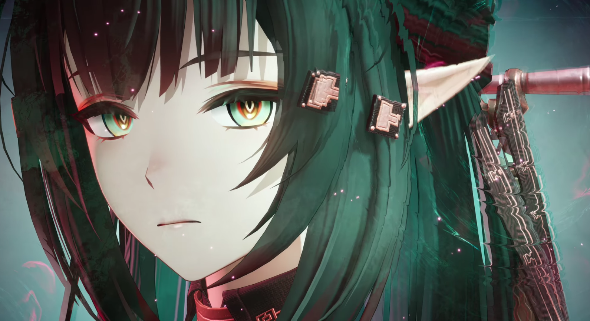

## Numpy實作後
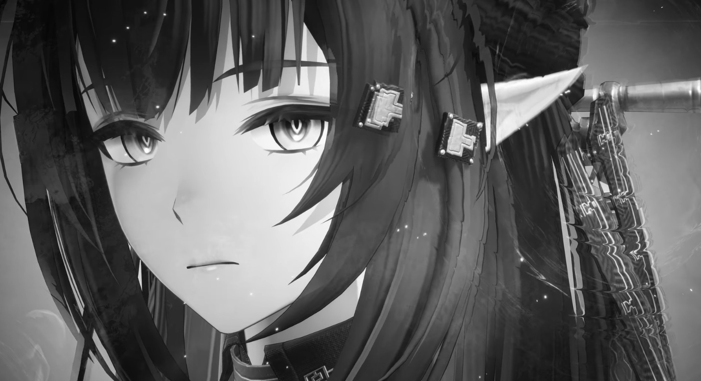

## Opencv實作後
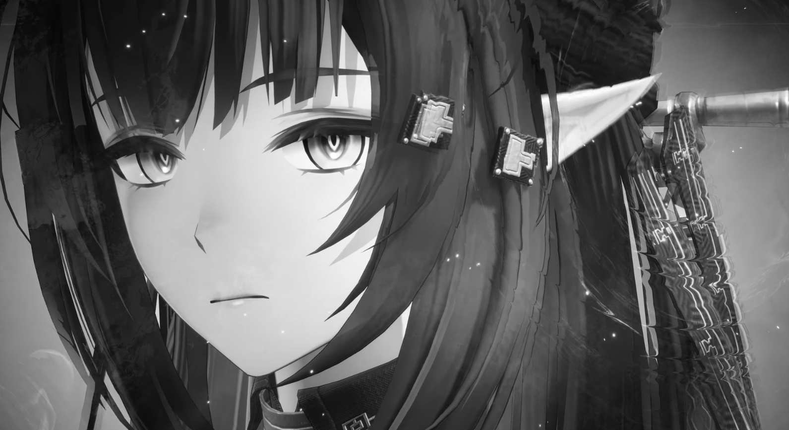

## 執行比較(1000次)
### ========== 執行速度 ==========
NumPy總時間：15.421986 秒  
平均時間：0.015421986 秒  

OpenCV總時間：0.473518 秒  
平均時間：0.000473518 秒

### ========== 影像差異 ==========
最大像素差異：1  
平均像素差異：0.501875  
不同像素數量：691486

### ========== 記憶體使用量 ==========
NumPy目前記憶體：1.4575 MB  
峰值記憶體：32.9937 MB

OpenCV目前記憶體：1.3150 MB  
峰值記憶體：2.6291 MB

## 結論
### 速度方面
opencv是專門為影像處理設計並最佳化，numpy是矩陣計算工具，可以看到opencv快上不少
### 影像差異
兩種方法都差不多
### 記憶體使用
numpy在計算過程中會產生不少暫存矩陣，這導致了峰值記憶體比較高

# Quiz2
## 原圖
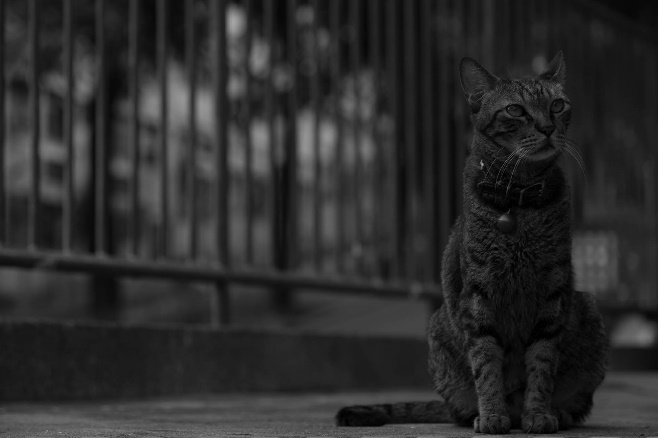
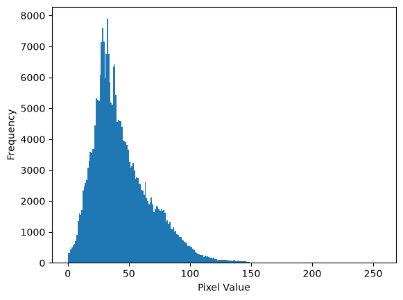

## by Numpy
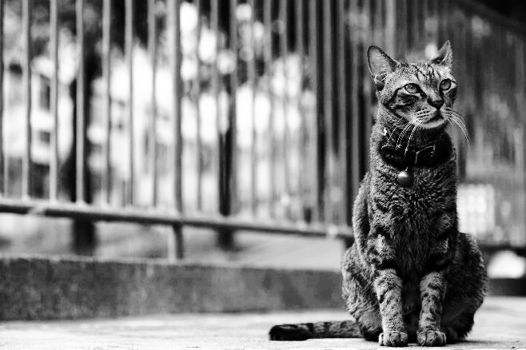
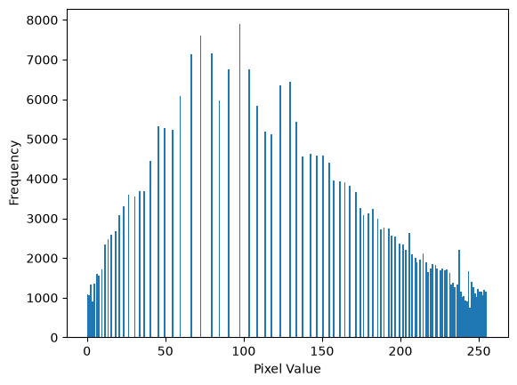

## by opencv

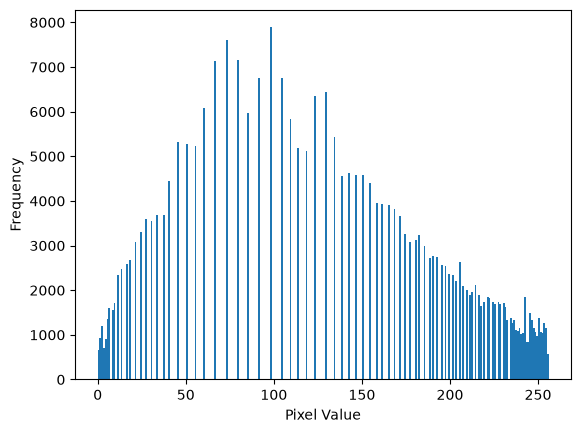

## 執行比較(1000次)
### ========== 執行速度 ==========
numpy平均時間: 0.003351 s  
numpy總時間: 3.350787 s  
OpenCV平均時間: 0.000145 s  
OpenCV總時間: 0.144951 s  

### ========== 影像差異 ==========
最大像素差異：0.49708205673314865  
平均像素差異：0.24481239895505275  
不同像素數量：287872  

### ========== 記憶體使用量 ==========
NumPy目前記憶體：0.0021 MB  
峰值記憶體：4.4679 MB

OpenCV目前記憶體：0.0010 MB  
峰值記憶體：0.2760 MB

### 結論
### 速度方面
採用opencv在速度上有顯著的優勢，但這優勢是來自於opencv針對影像處理優化後的結果
Numpy實作方面，我是直接把公式寫出來
### 影像差異
兩種方法都差不多
### 記憶體使用
記憶體方面，Numpy計算過程會產生一些暫存矩陣，所以記憶體用量稍高。

# Quiz3
## 原圖
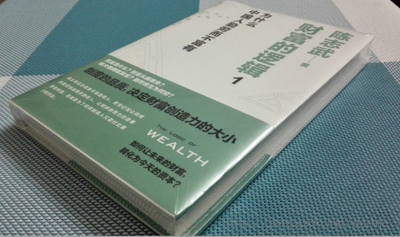

## 校正後
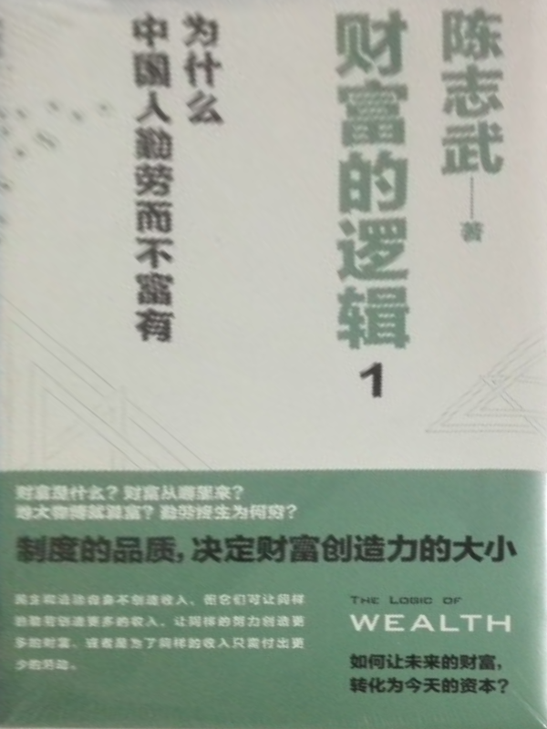

## 結論
我是採用手動標示四個點，這樣效果最好。在嘗試自動化的過程中，首先將原圖灰階化再canny edge detection，但是書的有一條邊偵測不到。後來嘗試插入高斯模糊或histogram equalization，但都沒有偵測到缺失的邊。這張圖的背景有許多密密麻麻的小格，也干擾了canny edge detection。

# Quiz4
## 原圖
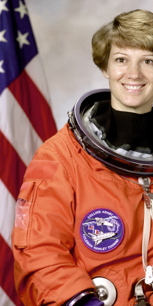
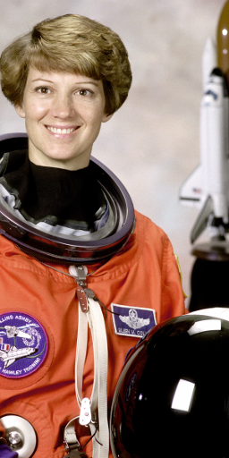

## 合併後
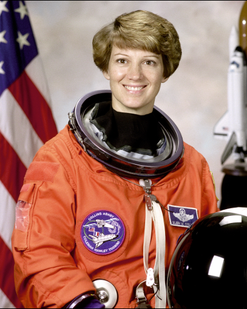

## 結果
我嘗試將任一方旋轉不同角度後合併，例如左邊部分倒轉180  
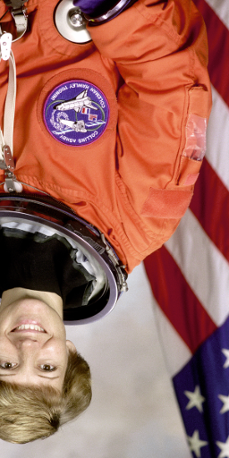  
結果特徵點依然配得上  
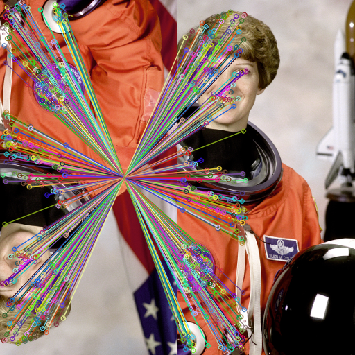  
合併後依左邊部分為主  
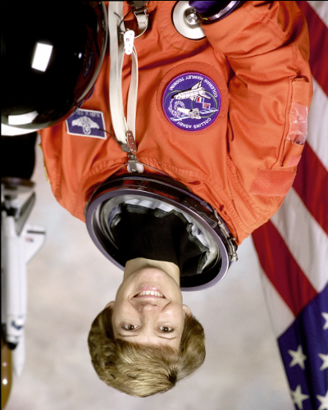  
我發現只要一開始重疊的部分有挑好，在任意旋轉不影響重疊(例如裁切到了)的部分的前提下，都能做得很好  

在亮度方面，我將右邊部分調得很暗(亮度-100、曝光-75)  
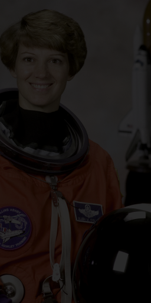  
還是能配對成功，但已經是極限了  
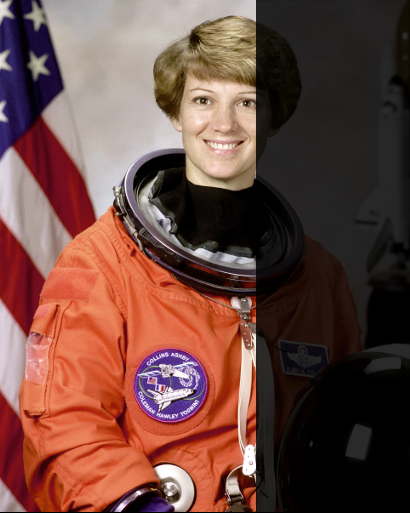  

在重疊部分方面，我大幅減少了重疊部分，只對右邊部分做編輯  
  
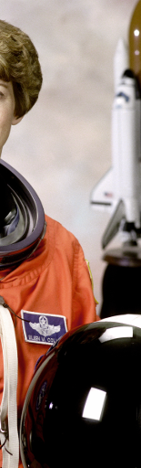  
結果重疊資訊不足，導致合併不好或配不起來     
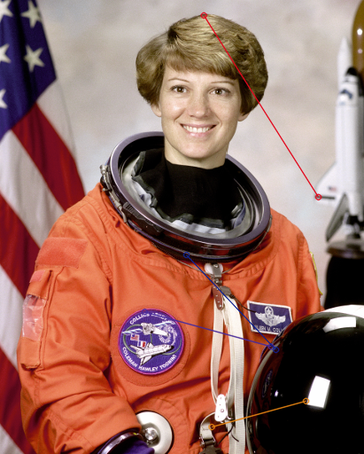 (此圖為特徵配對)  
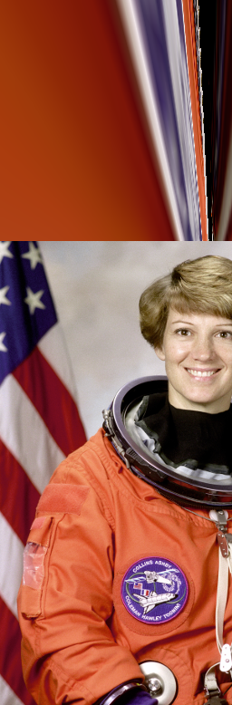 (合併後)  

