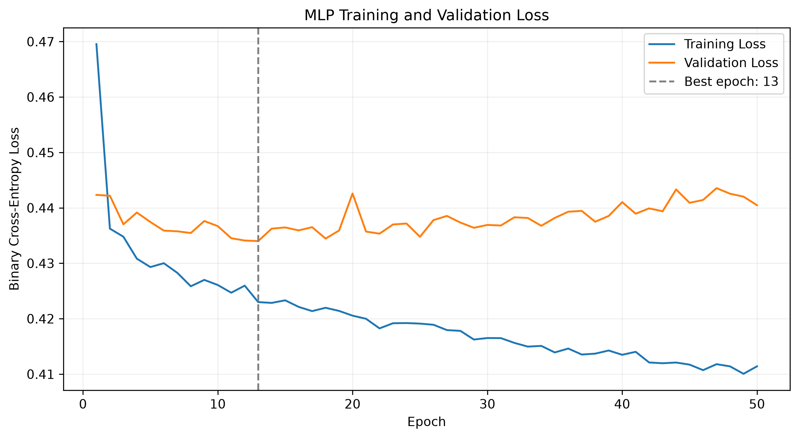
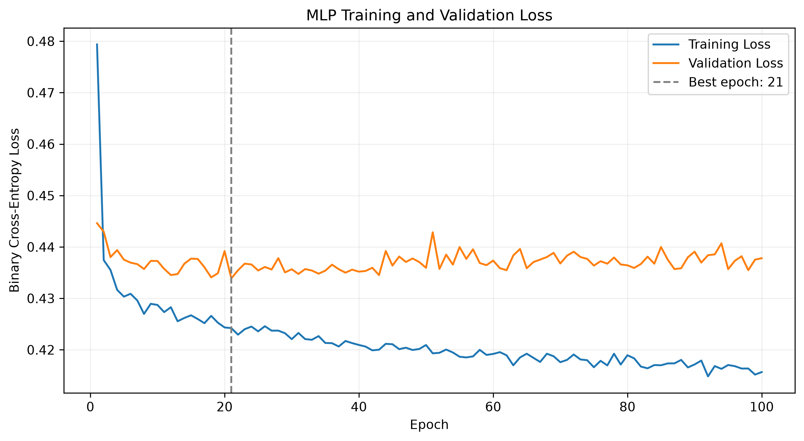
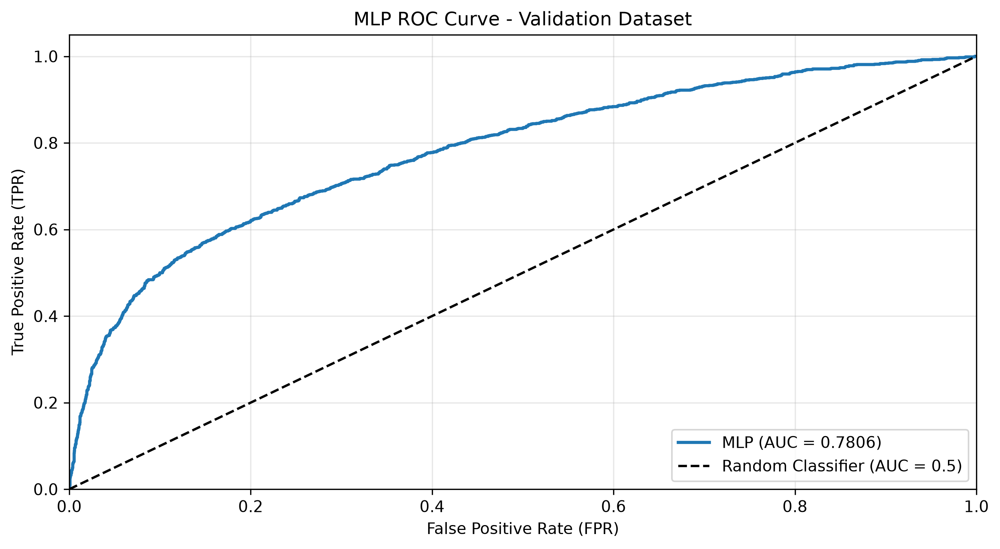
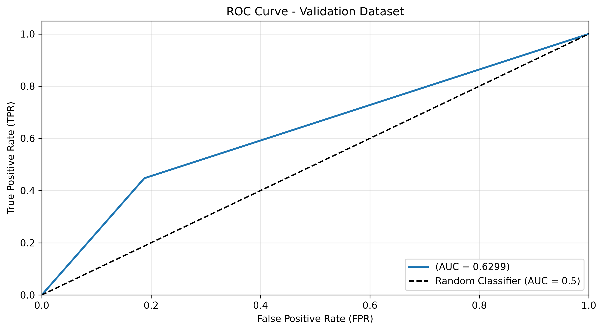

# Quiz1  
## basic  
我選Decision Tree這個model，首先我取得模型輸出的分類分數或機率：  
```text  
機率=0.02964, 數量=23592
機率=0.02965, 數量=23591
機率=0.02968, 數量=23589
機率=0.03034, 數量=23541
機率=1.00000, 數量=5687 
```  
因此我把thershold設定為：  
```text  
for threshold in [0.02964, 0.02965, 0.02968, 0.03034, 0.031]:  
```  
分別計算後得到：  
```text  
threshold=0.02964 | accuracy=0.30658 | precision=0.10186 | recall=0.91565 | f1=0.18333
threshold=0.02965 | accuracy=0.30658 | precision=0.10186 | recall=0.91565 | f1=0.18333
threshold=0.02968 | accuracy=0.74978 | precision=0.21736 | recall=0.74741 | f1=0.33678
threshold=0.03034 | accuracy=0.97187 | precision=1.00000 | recall=0.66906 | f1=0.80172
threshold=0.03100 | accuracy=0.97187 | precision=1.00000 | recall=0.66906 | f1=0.80172
threshold=0.50000 | accuracy=0.97187 | precision=1.00000 | recall=0.66906 | f1=0.80172
threshold=0.80000 | accuracy=0.97187 | precision=1.00000 | recall=0.66906 | f1=0.80172
```  

## advanced  
這次我選用Logistic Regression，模型輸出的分類分數或機率：  
```text  
機率=0.0000, 數量=9764
機率=0.0001, 數量=6723
機率=0.0002, 數量=3885
機率=0.0003, 數量=2775
機率=0.0004, 數量=2240
機率=0.0005, 數量=1841
機率=0.0006, 數量=1596
機率=0.0007, 數量=1395
機率=0.0008, 數量=1236
機率=0.0009, 數量=1121
機率=0.0010, 數量=919
機率=0.0011, 數量=952
機率=0.0012, 數量=870
機率=0.0013, 數量=863
機率=0.0014, 數量=742
機率=0.0015, 數量=736
機率=0.0016, 數量=703
機率=0.0017, 數量=643
機率=0.0018, 數量=627
...
機率=0.9997, 數量=58
機率=0.9998, 數量=85
機率=0.9999, 數量=143
機率=1.0000, 數量=74  
```  
這跟decision tree差非常多，原因是：  
```text  
Decision Tree會先把資料一路切分，每一個最終的leaf裡面會有一群training samples。Decision Tree的predict_proba基本上是在問：
這個leaf裡，訓練資料有多少比例是diabetes=1？
例如有：
diabetes=0，9700 人
diabetes=1，300 人。
那所有落到這個 leaf 的人都會得到，P(diabetes=1)=0.03，這300個人拿到相同的機率。
```  
在相同的threshold下：  
```text  
threshold=0.02964 | accuracy=0.79440 | precision=0.28697 | recall=0.95565 | f1=0.44140
threshold=0.02965 | accuracy=0.79441 | precision=0.28698 | recall=0.95565 | f1=0.44141
threshold=0.02968 | accuracy=0.79455 | precision=0.28712 | recall=0.95565 | f1=0.44158
threshold=0.03034 | accuracy=0.79683 | precision=0.28929 | recall=0.95435 | f1=0.44399
threshold=0.03100 | accuracy=0.79911 | precision=0.29156 | recall=0.95353 | f1=0.44657
threshold=0.50000 | accuracy=0.96016 | precision=0.86620 | recall=0.62835 | f1=0.72835
threshold=0.80000 | accuracy=0.95519 | precision=0.98109 | recall=0.48212 | f1=0.64653  
```  
仔細看threshold=0.5和0.8的各項指標可以發現，基本上logistic regression是小輸decision tree的。  

# Quiz2  
## loss  
  

## 參數  
Epoch=50  
Batch Size=64  
Learning Rate=0.001  
Optimizer=Adam  
Hidden Layer / Neuron 數量：2 層／每層分別為 64、32 個神經元。  

### 展示一筆sample  
```text  
# 5. 實際預測 Validation Dataset的一筆sample
model.load_state_dict(best_state)
model.eval()

sample_x, sample_y = val_dataset[35]

with torch.no_grad():
    sample_input = sample_x.unsqueeze(0).to(device)

    logit = model(sample_input)
    probability = torch.sigmoid(logit).item()

predicted_label = int(probability >= 0.5)
actual_label = int(sample_y.item())

print(f"預測違約機率：{probability:.2%}")
print(f"預測類別：{predicted_label}")
print(f"真實類別：{actual_label}")
print("0 = 未違約，1 = 違約")
```  
```text  
預測違約機率：2.11%  
預測類別：0  
真實類別：0  
0 = 未違約，1 = 違約  
```
## 結論  
從上圖的loss，我認為目前的model問題是overfitting了，因此我試了：將hidden layer減少一層、調整learning rate、epochs  

## 改善前的loss  
  

## 改善前的confusion matrix  
threshold = 0.5時  
Accuracy ：81.95%  
Precision：69.71%  
Recall   ：36.84%  
F1-score ：48.21%  

## 改善後的loss  
  

## 改善前的confusion matrix  
threshold = 0.5時  
Accuracy ：82.17%  
Precision：71.85%  
Recall   ：35.82%  
F1-score ：47.80%  

## 結論  
可能是這個model不太適合處理這份資料，也有可能是目前特徵的預測能力有限。

# Quiz3  
## ROC curve  
  

roc就是在不同threshold下，將真陽性率和假陽性率畫在座標上，曲線越接近左上角越好。  
auc越高，表示模型越能分辨誰比較可能違約。

## advanced  
另一個model的roc curve和auc  
    

很明顯上面那張圖的roc curve更接近左上角，auc也更高一些。因此上面那張圖的MLP model具有較好的正負樣本區分能力。
