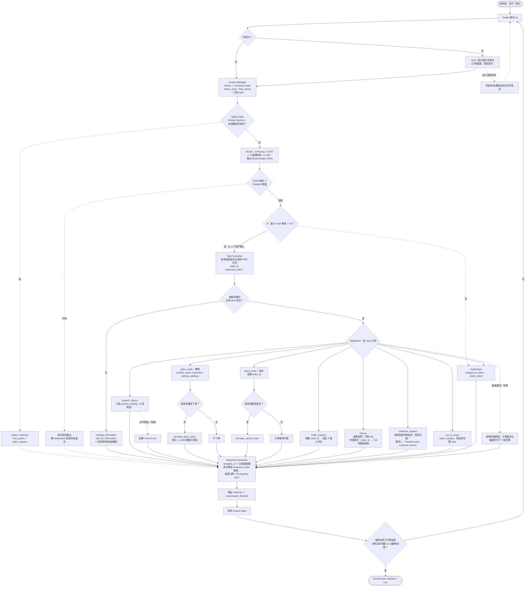

# 作業一：系統架構圖

依 [router.json](router.json) 與 [scheme.json](scheme.json) 繪製。

```mermaid
flowchart TD
    U(["使用者：文字／圖片"]) --> UI["Gradio 聊天 UI"]
    UI --> HASIMG{"附圖片？"}
    HASIMG -- 是 --> VLM["VLM：圖片轉文字描述<br/>（訂單截圖、瑕疵照片）"]
    HASIMG -- 否 --> CTX
    VLM --> CTX["Context Manager<br/>history ＋ structured state<br/>active_route／task_queue／已知 slots"]
    VLM -. 圖片讀取失敗 .-> E_IMG["請使用者重傳或改用文字描述"] -.-> UI

    CTX --> SAFE{"Safety Gate<br/>Prompt Injection／<br/>未授權資料操作？"}
    SAFE -. 是 .-> BLK["status = blocked<br/>next_action = reject_request"] -.-> RG

    SAFE -- 否 --> ROUTER["Router（A Prompt／B SFT／C 限制解碼／D Clef）<br/>輸出 RouterOutput JSON"]
    ROUTER --> VAL{"JSON 解析 ＋<br/>Pydantic 驗證"}
    VAL -. 失敗 .-> E_JSON["保存原始輸出<br/>轉 clarification 請使用者重述"] -.-> RG
    VAL -- 通過 --> THR{"D：最大 route 機率 > 0.6？"}
    THR -. 否 .-> CLAR
    THR -- "是（A–C 不套門檻）" --> TC

    TC["Task Controller<br/>多意圖依首次出現排 FIFO 佇列<br/>（task_id、sequence_order）"] --> SLOT{"每個任務的<br/>必填 slots 齊全？"}
    SLOT -- 否 --> ASK["missing_information<br/>ask_for_information<br/>一次詢問所有缺漏欄位"] --> RG
    SLOT -- 是 --> DISP{"Dispatcher：依 route 分流"}

    DISP --> PI["product_inquiry<br/>只查 product_catalog（3 項商品）"]
    PI -. 未列商品／規格 .-> IDK["回覆 I don't know"]
    DISP --> PO["place_order：購買<br/>product_name＋quantity＋delivery_address"]
    PO --> PCONF{"使用者確認下單？"}
    PCONF -- 是 --> PSIM["simulate_place_order<br/>產生 1–1000 模擬訂單號"]
    PCONF -- 否 --> PDEC["不下單"]
    DISP --> CO["place_order：取消<br/>需要 order_id"]
    CO --> CCONF{"使用者確認取消？"}
    CCONF -- 是 --> CSIM["simulate_cancel_order"]
    CCONF -- 否 --> CDEC["訂單維持不變"]
    DISP --> OT["order_tracking<br/>需要 order_id → 固定 3 個工作天"]
    DISP --> RET["returns<br/>政策詢問：不需 slot<br/>申請退貨：order_id → 7 天內模擬退款"]
    DISP --> CS["customer_support<br/>技術問題先問症狀／意見回饋／<br/>轉真人：Transferring to customer service"]
    DISP --> OOS["out_of_scope<br/>reject_request，保留原任務 state"]
    DISP --> CLAR["clarification<br/>ambiguous_intent → clarify_intent"]
    DISP -. 後端逾時／失敗 .-> E_SVC["說明失敗原因，不假裝成功<br/>繼續佇列下一個任務"]

    PI & IDK & PSIM & PDEC & CSIM & CDEC & OT & RET & CS & OOS & CLAR & E_SVC --> RG
    RG["Response Generator<br/>template_id ＋ 已驗證變數<br/>多任務依 sequence_order 串接，<br/>結尾只問一次 Anything else?"] --> OUT["輸出 response ＋ conversation_finished"]
    OUT --> UPD["更新 Context state"] --> END{"使用者表示不需協助<br/>或外部計時器 10 分鐘無回應？"}
    END -- 否 --> UI
    END -- 是 --> FIN(["conversation_finished = true"])
```
